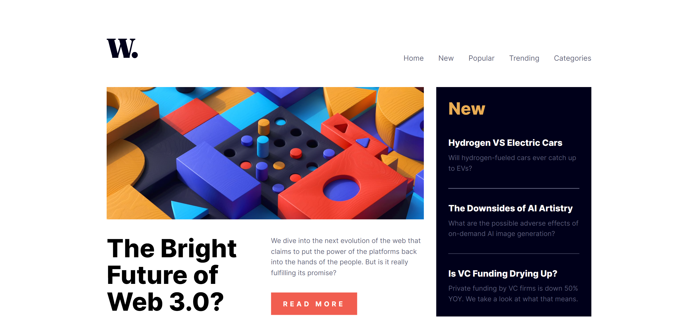
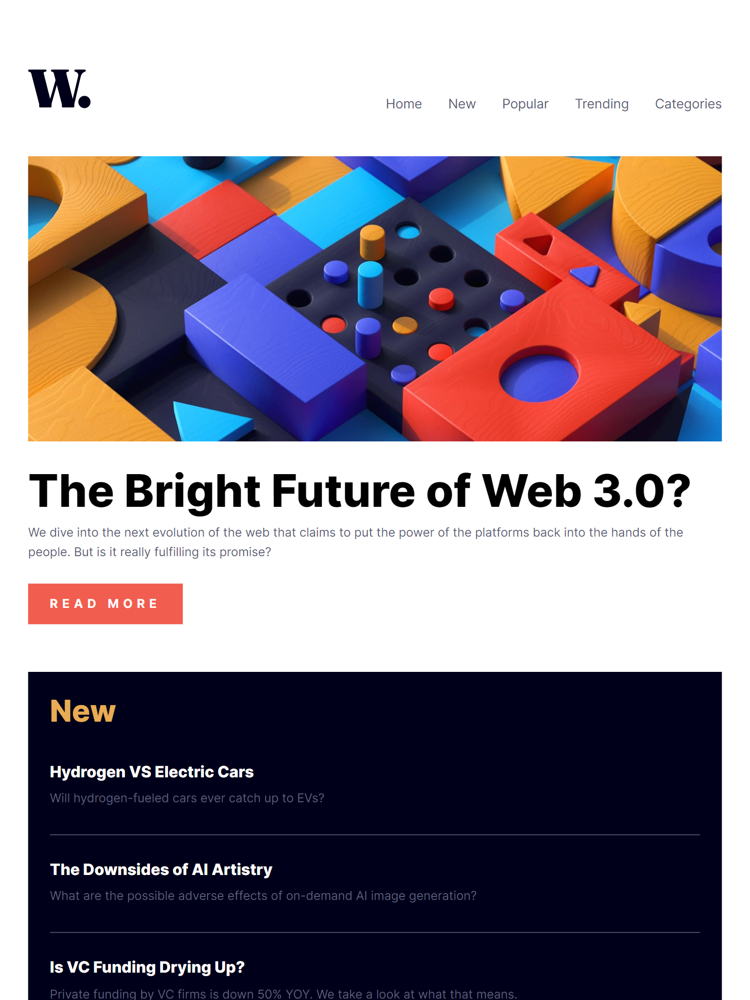

# Frontend Mentor - News homepage solution

This is a solution to the [News homepage challenge on Frontend Mentor](https://www.frontendmentor.io/challenges/news-homepage-H6SWTa1MFl). Frontend Mentor challenges help you improve your coding skills by building realistic projects.

## Table of contents

- [Overview](#overview)
  - [The challenge](#the-challenge)
  - [Screenshots](#screenshots)
  - [Links](#links)
- [My process](#my-process)
  - [Built with](#built-with)
- [Getting started](#getting-started)
- [Author](#author)

## Overview

### The challenge

Your users should be able to:

- View the optimal layout for the interface depending on their device's screen size

- See hover and focus states for all interactive elements on the page

### Screenshots

## Desktop view

## Tablet view

## Mobile view

### Links

- Solution URL: [Source code](https://github.com/cwasi/news-homepage)
- Live Site URL: [Live site](https://cwasi-news-homepage.netlify.app/)

## My process

### Built with

- Semantic HTML5 markup
- SCSS
- Grid & Flex

## Getting Started

- run `npm install` or `npm i` to install all dependencies
- run `npm start` to run the server

## Author 👦

- GitHub - [@cwasi](https://github.com/cwasi)
- Frontend Mentor - [@cwasi](https://www.frontendmentor.io/profile/cwasi)
